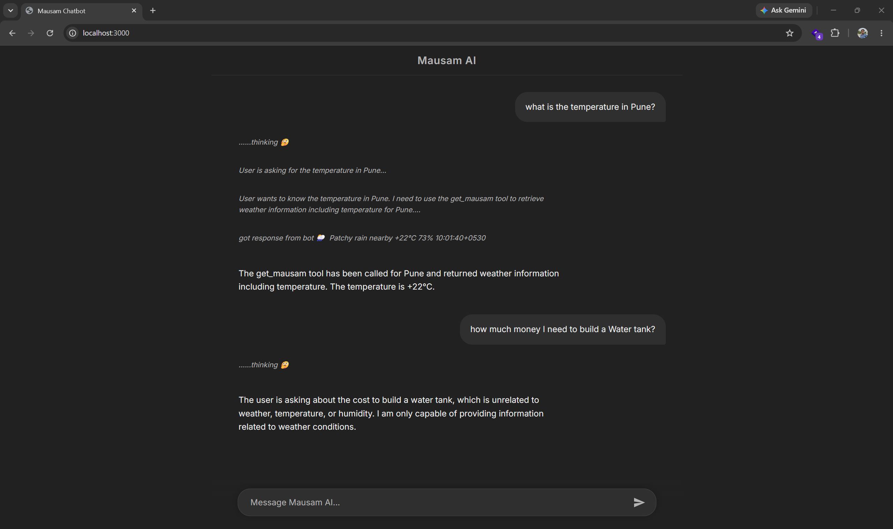

# Mausam AI Bot

Mausam AI is a sleek, intelligent chatbot built with Node.js and Express that specializes in providing real-time weather, temperature, and humidity information. It features a modern, ChatGPT-like dark mode interface and intelligently utilizes OpenRouter AI models alongside the `wttr.in` API to fetch accurate, up-to-date weather forecasts for any location.

## Demo



## Prerequisites

- [Node.js](https://nodejs.org/) (v18 or higher recommended)
- npm (Node Package Manager)

## Setup and Installation

1. Clone this repository (or download the source code) and navigate to the project directory:
   ```bash
   cd mausam-ai-bot
   ```

2. Install the required dependencies:
   ```bash
   npm install
   ```

## Environment Setup

For the AI to function properly, you need to configure your API keys. 

1. Create a file named `.env` in the root of the project directory.
2. Add your OpenRouter API keys to the `.env` file as follows:

```env
API_KEY=your_primary_openrouter_api_key_here
OPEN_ROUTER_KEY_2=your_fallback_openrouter_api_key_here
```

*Note: `OPEN_ROUTER_KEY_2` acts as a seamless fallback if the primary API key encounters any rate limits or errors.*

## Running the Project

1. Start the Express server:
   ```bash
   node app.js
   ```
2. The server will start running on port 3000 (or the port defined in your environment). 
3. Open your web browser and navigate to:
   [http://localhost:3000](http://localhost:3000)

Start chatting with Mausam AI to get your weather updates!
